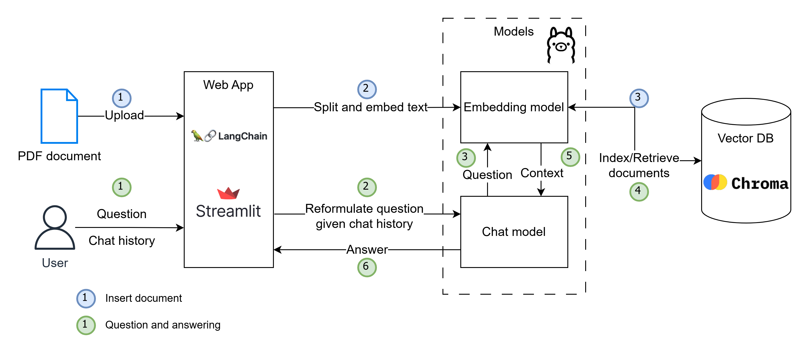
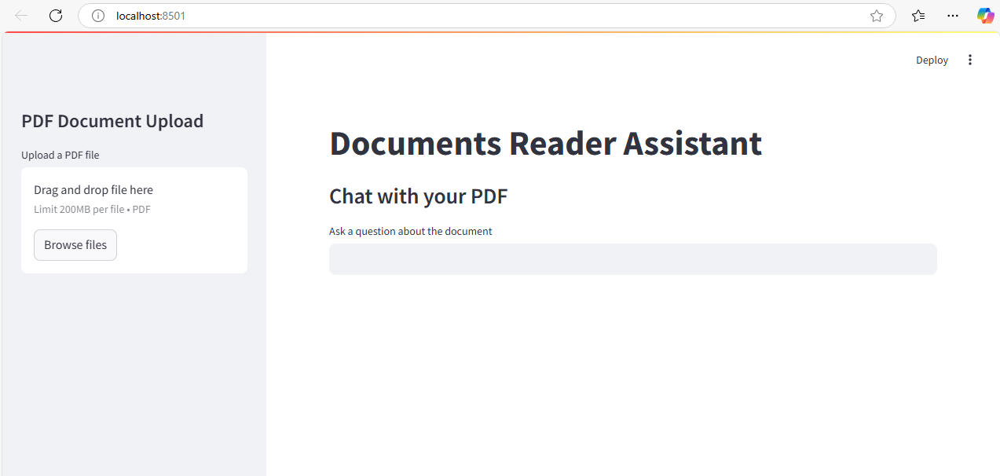
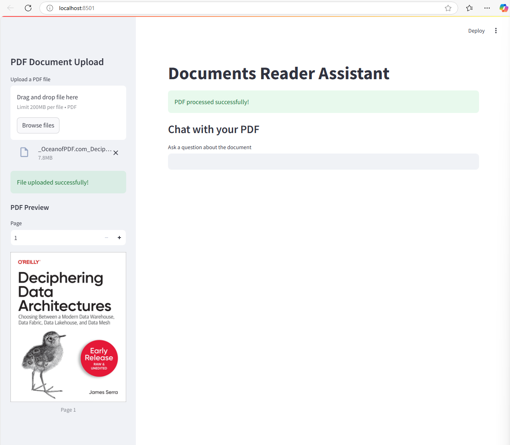
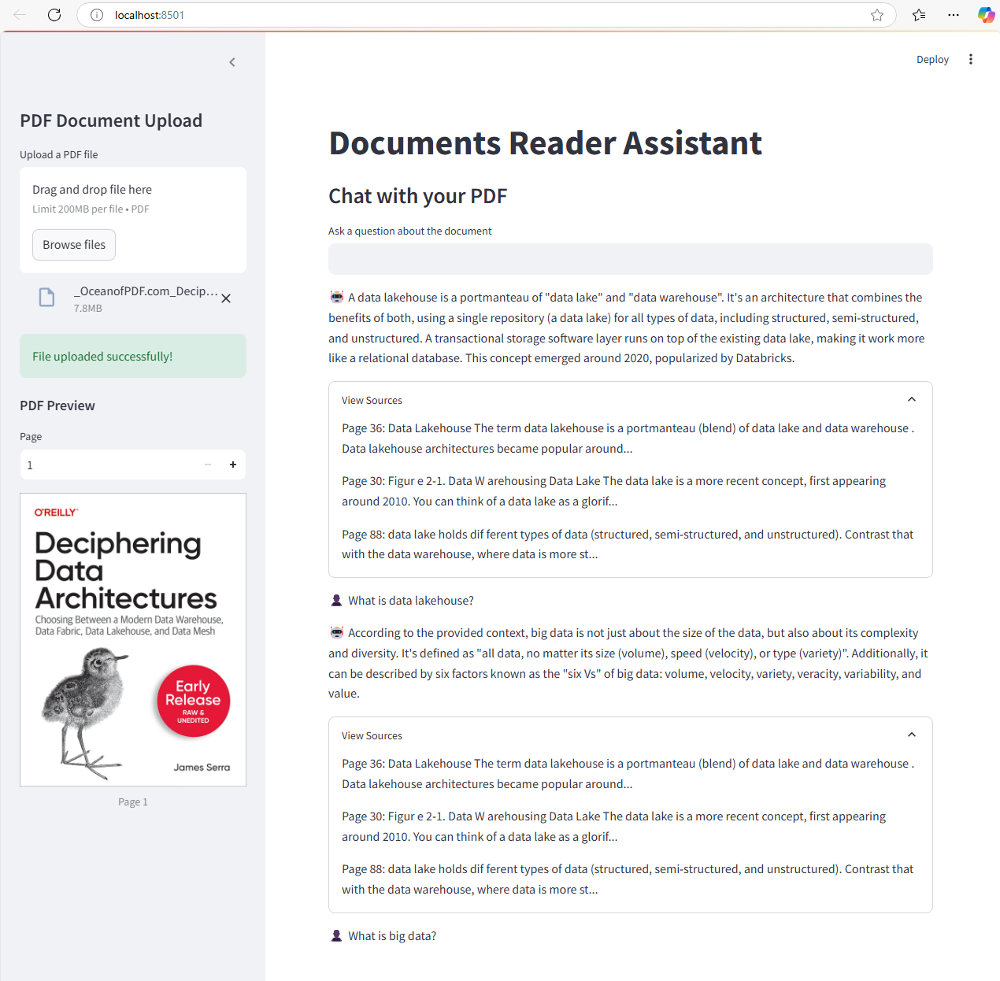

# Private PDF Reader Assistant

## Introduction
This is a private assistant running locally on your machine. It uses Large Language Model (LLM) and Retrieval-Augmented Generation (RAG) techniques to help you answer questions based on your PDF document. Since it operates on your computer, your data remains stored locally, ensuring your privacy.

## Architecture
### Diagram



### Components
- Web application written in Python, using Langchain for orchestion of LLM workflows and Streamlit for handling user's interaction.
- LLM Models are deployed locally on a machine using Ollama. Ollama supports wide range of LLM, including `nomic-embed-text` for embedding and `llama-3.1` for chat.
- ChromaDB is used as Vector DB for this application.

### Flows
#### Ingest document
1. The assistant allows user to upload a PDF file.
2. The file is processed, extracted text, splitted and embedded using an embedding model.
3. The embeddings and their metadata are stored in VectorDB.

#### Question and Answering
1. User's question and chat history are submitted to the assistant.
2. A chat model powered by a LLM reformulates the question, given the chat history and the latest question.
3. The reformulated question is then embedded using the embedding model.
4. The embedding of the question is used to retrieve context.
5. The context is passed to the Chat model.
6. Based on the retrieved context, the Chat model generates the answer to user.

## Installation
### Install Ollama
Ollama is a lightweight, extensible framework for building and running language models on the local machine.

Install Ollama from: https://ollama.com

Create models for usage
```
ollama pull nomic-embed-text
ollama pull llama-3.1
```

### Install python dependencies
Ensure to install Python and its libraries listed in the `requirements.txt`.

### Start the application
Start the application by the command:
```
streamlit run main.py
```
The assistant interface:


## Demo
Upload a PDF file on the left sidebar and wait for the file to be processed.


Start asking questions. 


Video (VN): https://youtu.be/52j9PIn9wnw

## References
https://www.educative.io/blog/ollama-guide